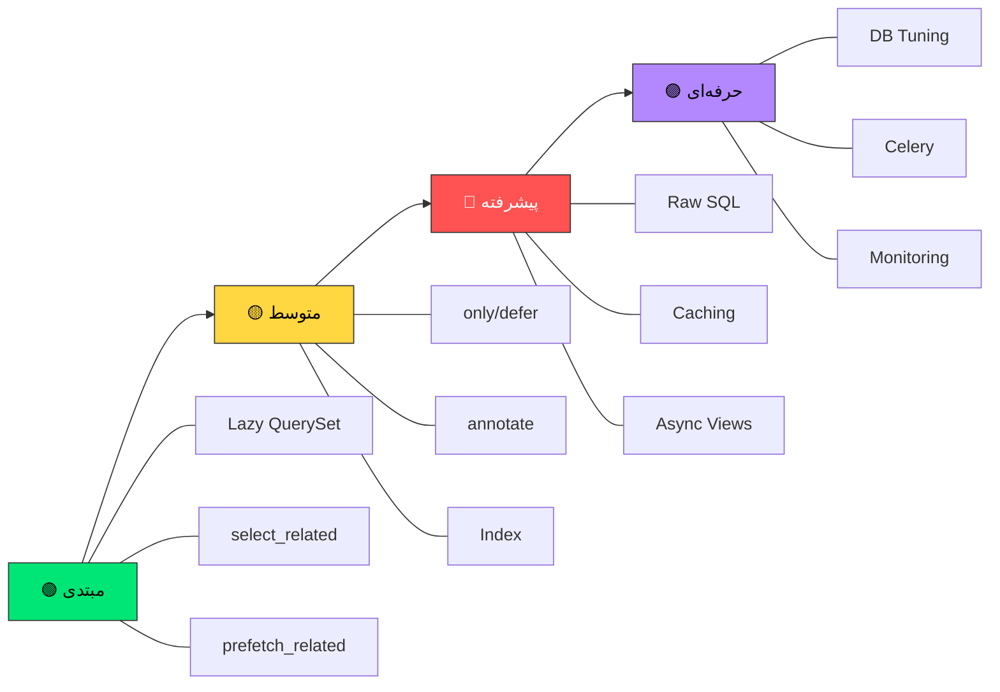
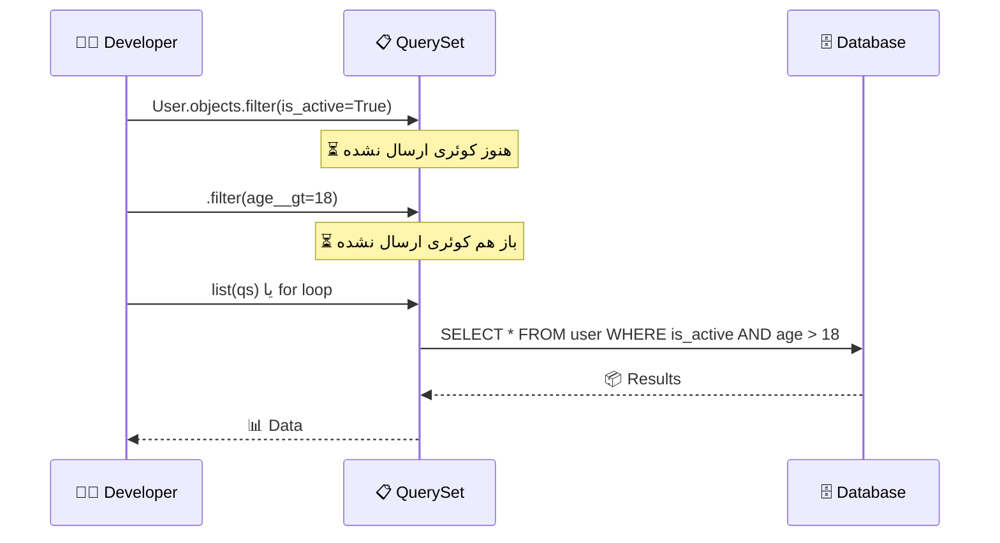
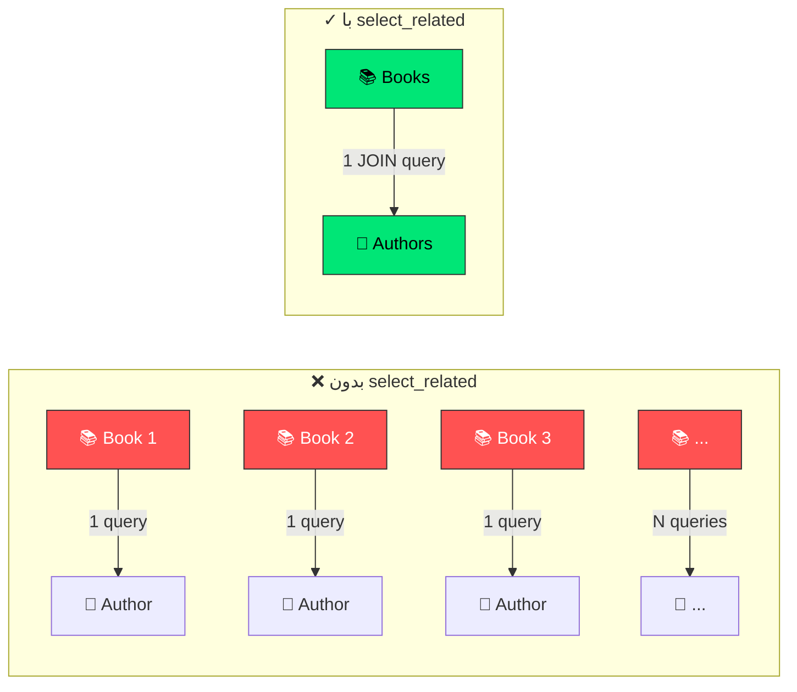
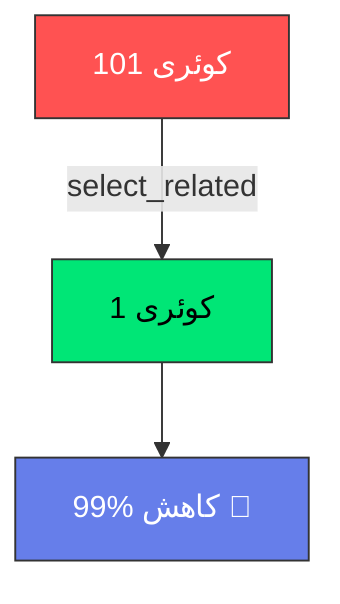
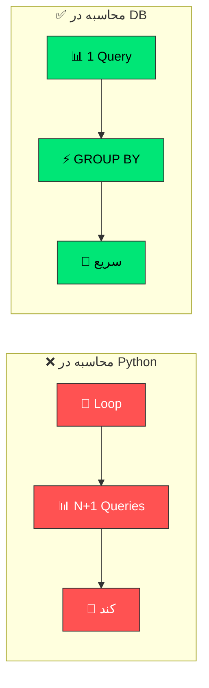
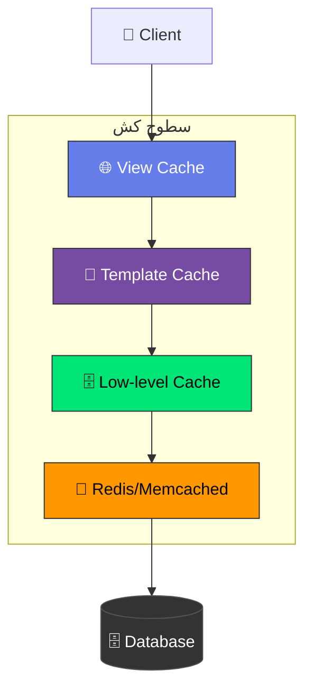

<div align="center">


# 🚀 Django Optimization Bible

### کتاب مقدس بهینه‌سازی جنگو — از مبتدی تا حرفه‌ای

<br>

[](https://www.djangoproject.com/)
[](https://www.python.org/)
[](LICENSE)
[](https://github.com/your-repo/django-optimization/stargazers)
[](http://makeapullrequest.com)

<br>


<br>


</div>

---

## 📖 فهرست مطالب

<table>
<tr>
<td width="50%">

### 🟢 بخش‌های مبتدی
- [⚡ Lazy Evaluation](#-1-lazy-evaluation-در-queryset)
- [🔗 select_related](#-2-select_related--حل-n1)
- [🔄 prefetch_related](#-3-prefetch_related--روابط-many)

### 🟡 بخش‌های متوسط
- [📊 only / defer](#-4-only-و-defer--بارگذاری-انتخابی)
- [🧮 annotate / aggregate](#-5-annotate-و-aggregate--محاسبه-در-db)
- [📇 Index‌ها](#-6-indexها--سرعت-جستجو-را-100x-کن)

</td>
<td width="50%">

### 🔴 بخش‌های پیشرفته
- [🛠️ Raw SQL](#-7-raw-sql--وقتی-orm-کافی-نیست)
- [🧠 Caching](#-8-caching--حافظه-پنهان-چندسطحی)
- [⚡ Async Views](#-9-async-views--ویوهای-ناهمگام)

### 🟣 بخش‌های حرفه‌ای
- [🔧 Database Tuning](#-10-database-tuning)
- [📦 Connection Pool](#-11-connection-pool)
- [🚀 Bulk Operations](#-12-bulk-operations)
- [📡 Signals](#-13-signals)
- [🎯 Serializer](#-14-serializer)
- [🛡️ Middleware](#-15-middleware)
- [⏰ Celery](#-16-celery)
- [📊 Monitoring](#-17-monitoring)
- [🔒 Security](#-18-security)

</td>
</tr>
</table>

---

## 🎯 نمودار سطوح



---

## ⚡ 1. Lazy Evaluation در QuerySet

> **اولین قانون:** جنگو تا زمانی که واقعاً به داده نیاز نداشته باشی، کوئری نمی‌زنه!

<div align="center">



</div>

<details>
<summary>🔍 <b>مثال کد — کلیک کنید</b></summary>

<br>

<table>
<tr>
<th width="50%">❌ اشتباه</th>
<th width="50%">✅ درست</th>
</tr>
<tr>
<td>

```python
# ❌ تبدیل زودهنگام به list
users = list(User.objects.all())
for u in users:
    if u.age > 18:
        print(u.name)
```

</td>
<td>

```python
# ✓ فیلتر در سطح دیتابیس
users = User.objects.filter(
    is_active=True,
    age__gt=18
)
for u in users:
    print(u.name)
```

</td>
</tr>
</table>

</details>

<div align="center">

| 📊 قبل | 📊 بعد | 📈 بهبود |
|:---:|:---:|:---:|
| بارگذاری کل جدول | فیلتر در DB | `⚡ سریع‌تر` |

</div>

---

## 🔗 2. select_related — حل N+1

> **معروف‌ترین مشکل عملکردی جنگو:** N+1 Query Problem

<div align="center">



</div>

<details>
<summary>🔍 <b>مثال کد — کلیک کنید</b></summary>

<br>

<table>
<tr>
<th width="50%">❌ N+1 Problem</th>
<th width="50%">✅ select_related</th>
</tr>
<tr>
<td>

```python
# ❌ 101 کوئری!
books = Book.objects.all()[:100]
for book in books:
    print(book.author.name)
    # هر iteration = 1 کوئری اضافه
```

</td>
<td>

```python
# ✓ فقط 1 کوئری با JOIN
books = Book.objects.select_related(
    'author'
).all()[:100]

for book in books:
    print(book.author.name)
```

</td>
</tr>
</table>

</details>

<div align="center">



</div>

---

## 🔄 3. prefetch_related — روابط Many

> برای **ManyToMany** و **reverse ForeignKey** استفاده میشه

```mermaid
sequenceDiagram
    participant U as 👨‍💻 Code
    participant DB as 🗄️ Database
    
    rect rgb(10, 14, 23)
    Note over U,DB: ✅ با prefetch_related
    U->>DB: Query 1: SELECT * FROM article
    U->>DB: Query 2: SELECT * FROM tag JOIN article_tags
    DB-->>U: 📦 All data cached in memory
    U->>U: لود از کش — بدون کوئری اضافه ⚡
    end
```

<div align="center">



</div>

---

## 📊 4. only و defer — بارگذاری انتخابی

<div align="center">

| متد | کاربرد | مثال |
|:---:|:---:|:---:|
| `only()` | فقط فیلدهای مورد نیاز | `User.objects.only('name', 'email')` |
| `defer()` | حذف فیلدهای سنگین | `Article.objects.defer('content', 'raw_html')` |

</div>

---

## 🧮 5. annotate و aggregate — محاسبه در DB

<div align="center">



</div>

<details>
<summary>🔍 <b>مثال annotate — کلیک کنید</b></summary>

```python
from django.db.models import Count, Avg, F, Case, When, Value

products = Product.objects.annotate(
    review_count=Count('reviews'),
    avg_rating=Avg('reviews__rating'),
    profit=F('price') - F('cost'),
    status=Case(
        When(stock__gt=0, then=Value('موجود')),
        default=Value('ناموجود'),
    ),
).filter(avg_rating__gte=4.0)
```

</details>

---

## 📇 6. Index‌ها — سرعت جستجو را 100x کن

<div align="center">

```mermaid
graph TD
    A[🔍 جستجو بدون Index] -->|O(n)| B[🐌 Full Table Scan]
    C[🔍 جستجو با Index] -->|O log n| D[⚡ Index Lookup]
    
    B --> E[⏱️ 1000ms]
    D --> F[⏱️ 10ms]
    
    style A fill:#ff5252,stroke:#333,color:#fff
    style B fill:#ff5252,stroke:#333,color:#fff
    style C fill:#00e676,stroke:#333,color:#000
    style D fill:#00e676,stroke:#333,color:#000
    style E fill:#ff5252,stroke:#333,color:#fff
    style F fill:#00e676,stroke:#333,color:#000
```

</div>

<div align="center">

| نوع Index | کاربرد | مثال |
|:---:|:---:|:---:|
| 📄 تک‌فیلدی | فیلدهای ساده | `Index(fields=['price'])` |
| 📑 ترکیبی | کوئری‌های چندفیلدی | `Index(fields=['category', 'price'])` |
| 🔖 شرطی | فقط ردیف‌های مرتبط | `Index(condition=Q(is_active=True))` |
| 🔍 Gin | جستجوی متنی | `GinIndex(fields=['search_vector'])` |

</div>

---

## 🛠️ 7. Raw SQL — وقتی ORM کافی نیست

<div align="center">

```python
# 🛡️ همیشه از پارامتر استفاده کن!
cursor.execute(
    "SELECT * FROM user WHERE id = %s", 
    [user_id]  # ✅ Safe
)
# ❌ NEVER: f"SELECT * FROM user WHERE id = {user_id}"
```

</div>

---

## 🧠 8. Caching — حافظه پنهان چندسطحی

<div align="center">



</div>

---

## ⚡ 9. Async Views — ویوهای ناهمگام

```mermaid
sequenceDiagram
    participant C as 👤 Client
    participant S as 🖥️ Server
    
    rect rgb(10, 14, 23)
    Note over C,S: ❌ Sync — 6 ثانیه
    C->>S: Request
    S->>S: API 1 (2s) ⏳
    S->>S: API 2 (2s) ⏳
    S->>S: API 3 (2s) ⏳
    S-->>C: Response (6s total)
    end
    
    rect rgb(0, 30, 0)
    Note over C,S: ✅ Async — 2 ثانیه
    C->>S: Request
    par parallel requests
        S->>S: API 1 (2s) ⚡
    and
        S->>S: API 2 (2s) ⚡
    and
        S->>S: API 3 (2s) ⚡
    end
    S-->>C: Response (2s total) 🚀
    end
```

<div align="center">



</div>

---

## 📊 مقایسه عملکرد

```mermaid
gantt
    title زمان اجرای کوئری‌ها
    dateFormat X
    axisFormat %s ms
    
    section ❌ بدون بهینه‌سازی
    N+1 Queries     :0, 1000
    Full Table Scan :0, 800
    No Caching      :0, 600
    
    section ✅ با بهینه‌سازی
    select_related  :0, 50
    Index Lookup    :0, 10
    Redis Cache     :0, 5
```

<div align="center">



</div>

---

## 🏗️ ساختار پروژه

```
django-optimization-bible/
├── 📄 index.html          # نسخه وب کتاب
├── 📖 README.md           # این فایل
├── 📁 examples/
│   ├── 🐍 models.py       # مدل‌های نمونه
│   ├── 👁️ views.py        # ویوهای بهینه
│   ├── 🔧 optimize.py     # تکنیک‌های بهینه‌سازی
│   └── 📊 benchmarks.py   # بنچمارک‌ها
├── 📁 docs/
│   ├── 📝 querysets.md
│   ├── 🗄️ database.md
│   └── ⚡ performance.md
└── 📜 LICENSE
```

---

## 🚀 شروع سریع

<div align="center">

```bash
# 1️⃣ کلون کردن
git clone https://github.com/your-repo/django-optimization.git

# 2️⃣ نصب وابستگی‌ها
cd django-optimization
pip install -r requirements.txt

# 3️⃣ اجرای پروژه
python manage.py runserver

# 4️⃣ مشاهده بنچمارک‌ها
python manage.py benchmark
```

</div>

---

## 📈 آمار بهینه‌سازی

<div align="center">

<table>
<tr>
<td align="center">

<br>
<sub>select_related</sub>
</td>
<td align="center">

<br>
<sub>بهبود سرعت</sub>
</td>
<td align="center">

<br>
<sub>سطوح کش</sub>
</td>
<td align="center">

<br>
<sub>ناهمگام</sub>
</td>
</tr>
</table>

</div>

---

## 💡 نکات طلایی

<div align="center">

| # | نکته | توضیح |
|:---:|:---|:---|
| 1 | 🎯 **Lazy Evaluation** | هیچوقت QuerySet رو بدون نیاز به `list()` تبدیل نکن |
| 2 | 🔗 **select_related** | برای FK و OneToOne از JOIN استفاده کن |
| 3 | 🔄 **prefetch_related** | برای M2M از کوئری جدا استفاده کن |
| 4 | 📊 **only/defer** | فقط فیلدهای مورد نیاز رو بارگذاری کن |
| 5 | 📇 **Index** | فیلدهای filter و order_by رو ایندکس کن |
| 6 | 🧠 **Cache** | از کش چندسطحی استفاده کن |
| 7 | ⚡ **Async** | برای I/O-bound از async استفاده کن |
| 8 | 🛡️ **SQL Injection** | هیچوقت رشته مستقیم در SQL قرار نده |

</div>

---

## 🤝 مشارکت

<div align="center">

[](https://github.com/your-repo/django-optimization/issues)
[](https://github.com/your-repo/django-optimization/pulls)

<br>

**مشارکت شما خوش‌آمدید!** 🎉

<br>

<a href="https://github.com/your-repo/django-optimization/issues/new">
  
</a>
<a href="https://github.com/your-repo/django-optimization/issues/new">
  
</a>
<a href="https://github.com/your-repo/django-optimization/pulls">
  
</a>

</div>

---

## 📜 مجوز

<div align="center">

[](https://opensource.org/licenses/MIT)

این پروژه تحت مجوز MIT منتشر شده است.

</div>

---

## ⭐ ستاره‌ها

<div align="center">

[](https://star-history.com/#your-repo/django-optimization&Timeline)

</div>

---

<div align="center">

### 🌟 اگر این پروژه مفید بود، لطفاً ستاره بدهید! 🌟

<br>


<br>

**ساخته شده با ❤️ برای جامعه جنگو ایران**

[](https://t.me/django_iran)

</div>
